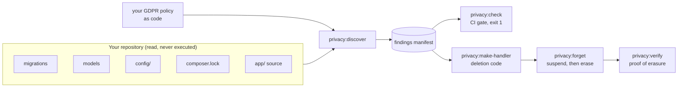

<h1 align="center">Privacy CI</h1>

<p align="center">
  <strong>Map the personal data in your Laravel application, write your GDPR policy as code,<br>execute it end to end, and fail CI the day new storage appears unclassified.</strong>
</p>

<p align="center">
  <a href="https://github.com/AsterlaneLabs/privacy-ci/actions/workflows/tests.yml"></a>
  <a href="https://packagist.org/packages/privacy-ci/laravel"></a>
  <a href="https://packagist.org/packages/privacy-ci/laravel"></a>
  
  <a href="https://packagist.org/packages/privacy-ci/laravel"></a>
  <a href="LICENSE"></a>
</p>

<p align="center">
  
</p>

Every backend team can delete a user from their primary database. Almost none can
prove the user is gone from Redis, S3, the search index, the warehouse and six SaaS
vendors. Almost none have a data map that is still true a year after somebody wrote it.

Five commands, and most teams need all five:

**Map it.** `privacy:discover` reads migrations, models, config and `composer.lock` and
reports every place personal data can reach: columns, the Redis keys and S3 paths written
from application code, and the third-party services it found in your dependencies. No
database connection, no credentials.

**Decide it.** `privacy:make-policy` scaffolds your GDPR rules as PHP, one line per
finding, every one commented out. Delete, anonymise, retain with a documented reason. It
lives in the repository, so it is reviewed in pull requests and deployed with the code
that created the data.

**Execute it.** The policy is not a document, it runs. `privacy:make-handler` turns it
into the deletion code, and `privacy:forget` drives the grace period, the reactivation
link, the reminders and the audit row.

**Prove it.** `privacy:verify` inspects the real stores after an erasure and reports
`PASS`, `FAIL` or `RETAINED` per address. What it could not reach is `UNCHECKED`, never
quietly passed.

**Keep it true.** `privacy:check` fails the build the day somebody adds user-linked
storage nobody classified. A map nobody enforces is a map that was accurate once.

**The whole package is free.** No account, no limits, no telemetry.

## Quick start

```bash
composer require privacy-ci/laravel && php artisan privacy:discover
```

That reports the whole map. No database connection, no `.env`, no credentials: discovery
reads from the checkout and never touches a row.

The rest of the sequence, once you have looked at the report:

```bash
php artisan privacy:make-policy      # scaffold the rules, every one commented out
php artisan privacy:make-handler     # turn the policy you edited into deletion code
php artisan privacy:forget 42        # suspend now, erase when the grace period closes
php artisan privacy:verify 42        # prove it landed, and say what could not be checked

php artisan privacy:check            # in CI: exit 1 on new storage with no policy
```

## Contents

- [Why bother before you have to](#why-bother-before-you-have-to)
- [How it works](#how-it-works)
- [1. Discover: where does personal data live?](#1-discover-where-does-personal-data-live)
- [2. Classify: your GDPR policy as code](#2-classify-your-gdpr-policy-as-code)
- [3. Gate: fail CI on new unclassified storage](#3-gate-fail-ci-on-new-unclassified-storage)
- [4. Generate the deletion handler](#4-generate-the-deletion-handler)
- [5. Erasure lifecycle: suspend, then delete](#5-erasure-lifecycle-suspend-then-delete)
- [6. Verify: did the erasure actually land?](#6-verify-did-the-erasure-actually-land)
- [Command reference](#command-reference)
- [Configuration](#configuration)
- [Certain findings versus likely ones](#certain-findings-versus-likely-ones)
- [The findings manifest](#the-findings-manifest)
- [What this is not](#what-this-is-not)
- [Development](#development)
- [License](#license)

## Why bother before you have to

Under the GDPR, failing to honour an erasure request sits in the higher penalty tier:
up to 20 million euros or 4% of worldwide annual turnover, whichever is larger. The UK
and most other regimes mirror that shape.

The fine is rarely the expensive part. What costs money is the scramble: a regulator or
a customer gives you 30 days, and an engineering team spends them reconstructing a data
map nobody wrote down, hunting through Redis keys and S3 prefixes by hand, under a
deadline, on work that ships nothing.

Building the map while nobody is asking takes an afternoon. Building it during the clock
takes a sprint, and you still cannot prove the deletion worked.

## How it works



Discovery and the policy meet in one document, the findings manifest. Everything
downstream is an operation on that document: the gate diffs it, the generator compiles it,
the verifier walks it against the real stores.

## 1. Discover: where does personal data live?

```bash
php artisan privacy:discover          # the report above
php artisan privacy:discover --json   # the findings manifest
```

Or without booting Laravel at all, which is what you want in CI:

```bash
vendor/bin/privacy-ci --path=. --no-ansi
```

<details>
<summary><strong>The full report, as text</strong></summary>

```text
PERSONAL DATA: HIGH CONFIDENCE

  audit_entries.actor_id           relationship    1.00 certain    DELETE
  comments.author_ip               name match      0.99            ANONYMIZE
  comments.user_id                 foreign key     1.00 certain    ANONYMIZE
  orders.buyer_id                  foreign key     1.00 certain    RETAIN
  orders.shipping_address          name match      0.95            RETAIN
  recommendation_events.device_id  name match      0.98            UNCLASSIFIED
  recommendation_events.user_id    foreign key     1.00 certain    UNCLASSIFIED
  sessions.ip_address              name match      0.99            ANONYMIZE
  sessions.user_id                 foreign key     1.00 certain    ANONYMIZE
  subscribers.email                name match      0.99            UNCLASSIFIED
  users.email                      name match      0.99            DELETE
  users.id                         subject root    1.00 certain    DELETE
  users.password                   name match      0.99            DELETE
  users.phone                      name match      0.99            DELETE
  profile:{id}                     declared        1.00 certain    DELETE
  avatars/{id}.jpg                 declared        1.00 certain    DELETE

PERSONAL DATA: POSSIBLE (review required)

  sessions.user_agent              name match      0.70            UNCLASSIFIED
  users.name                       name match      0.65            DELETE

LOW CONFIDENCE (may embed personal data)

  comments.body                    name match      0.40            UNCLASSIFIED
  recommendation_events.payload    name match      0.38            UNCLASSIFIED

STORES AND SERVICES DETECTED

  Intercom            config/services.php           not yet scannable
  Laravel Scout       laravel/scout                 not yet scannable
  Postmark            config/mail.php               not yet scannable
  Redis               predis/predis                 scannable
  S3                  config/filesystems.php        scannable
  Snowflake           config/services.php           not yet scannable
  Stripe              stripe/stripe-php             not yet scannable

  5 stores detected that this version cannot scan: Intercom, Laravel Scout, Postmark, Snowflake, Stripe
  Personal data may be flowing there unmapped.

20 locations found · 14 classified · 6 unclassified · 1 would fail CI
```

</details>

### It never touches your database

Discovery reads **migrations, config and `composer.lock` from source**. It opens no
database connection and never reads a row, so it runs safely in CI against a bare
checkout with no credentials present.

Migrations are replayed as a *history*, not unioned: a column added in 2021 and dropped
in 2023 does not appear in the results.

**Raw SQL migrations are read too.** Long-lived applications often never used the
Blueprint builder, their schema arrived as a dump wrapped in `DB::statement()`, and the
table it defines is usually the oldest and most important one:

```php
DB::statement("CREATE TABLE `legacy_members` (
  `member_id` int(10) unsigned NOT NULL AUTO_INCREMENT,
  `email` varchar(255) NOT NULL,
  `state` enum('Active','Suspended','Pending Close') NOT NULL,
  PRIMARY KEY (`member_id`),
  CONSTRAINT `fk` FOREIGN KEY (`owner_id`) REFERENCES `legacy_members` (`member_id`)
) ENGINE=InnoDB;");
```

Columns, nullability and inline `FOREIGN KEY` constraints are all extracted, and
`enum('Active','Pending Close')` does not shred the column list the way a naive comma
split would.

If your subject table is not `users.id`, say so:

```php
'subjects' => ['user' => 'legacy_members.member_id'],
```

### Models are read too

The model scanner catches associations the database does not know about. Plenty of
production schemas declare `belongsTo(User::class)` with no matching foreign key: the
link is real, the migration scanner cannot see it, and it is still deterministic enough
to fail a build on.

It also reads `$hidden` and encrypted casts. A developer marking a column sensitive in
the framework's own vocabulary is weak evidence on its own, but it usefully raises
confidence on a column a name heuristic was unsure about.

### Static analysis finds what the schema cannot

Plenty of personal data never reaches a column. Stage B reads your application code for
identifiers written to cache, object storage and Redis:

```php
Cache::put("user:{$user->id}", $payload);
Storage::disk('s3')->put("avatars/{$user->id}.jpg", $file);
Redis::set('profile:' . $user->id, $json);
```

```text
  user:{user.id}         inferred   0.80   UNCLASSIFIED
  avatars/{user.id}.jpg  inferred   0.80   UNCLASSIFIED
```

Patterns keep the interpolated expression, `user:{user.id}` and not `user:*`, because a
developer reading the report can judge the first at a glance and cannot judge the second
at all. Concatenation and interpolation both work, and `Storage::disk('s3')` attributes
the write to that disk rather than the default.

**Precision here is inherently poor**, and the design admits it. PHP interpolates
dynamically, applications wrap everything in repositories and helpers, and a key is only
recognisable as personal by how it is *named*: `user:{$userId}` and `report:{$reportId}`
are identical in shape. So every Stage B finding is `inferred`, which means it can only
ever warn:

| | |
|---|---|
| `report:{reportId}` | Ignored, names something other than the subject |
| `app:config` | Ignored, wholly literal, cannot key on a person |
| `Cache::get(...)` | Ignored, a read is not a write |
| Same key, three files | One finding, not three |
| Any finding at all | `inferred` · warns · never fails CI |

Set `discovery.source_paths` to `[]`, or pass `--no-static`, to switch it off.

## 2. Classify: your GDPR policy as code

Rules live in your repository, so they are versioned, reviewed in pull requests, and
deployed with the code that created the data. Changing a table from `RETAIN` to `DELETE`
becomes a code review with a named approver.

```php
namespace App\Privacy;

use App\Models\{Comment, Order, User};
use PrivacyCI\Policy\PrivacyPolicy;

class UserPrivacyPolicy extends PrivacyPolicy
{
    public function configure(): void
    {
        $this->subject(User::class);

        $this->delete(User::class);
        $this->anonymize(Comment::class, ['user_id' => null, 'author_ip' => null]);
        $this->retain(Order::class)->reason('statutory accounting retention, 7y');

        $this->deleteRedis('profile:{id}');
        $this->deleteStorage('avatars/{id}.jpg', disk: 's3');
    }
}
```

Register it in `config/privacy.php`, and every finding gains a classification: the
`DELETE` / `ANONYMIZE` / `RETAIN` column in the report above.

A rule naming specific columns narrows one covering the whole table. `RETAIN` without a
reason and `CUSTOM` without a handler are rejected outright: an undocumented retention is
the thing an auditor asks about first.

Rules for Redis, object storage, search indexes and third-party services **add** locations
to the map. The developer is describing somewhere the scanner cannot reach, and a declared
location belongs on the map just as much as a found one.

### Suppression needs a reason

`IGNORE` is the escape hatch, so it is not free:

```php
$this->ignore(FeatureFlag::class)->reason('internal flag, no subject link');
```

`RETAIN` and `IGNORE` both require a written reason, enforced at policy load. An
unexplained suppression is indistinguishable from an oversight when someone reads the
diff two years later.

### Scaffold it instead of writing it

Discovery on a mature codebase finds dozens of locations. Generate a policy to edit:

```bash
php artisan privacy:make-policy
php artisan privacy:make-policy --only-blocking   # just what fails CI today
```

```php
final class UserPrivacyPolicy extends PrivacyPolicy
{
    public function configure(): void
    {
        $this->subject(User::class);

        // ── recommendation_events ───────────────────── linked by user_id
        //    user_id                       1.00  recommendation_events.user_id -> users.id

        // $this->anonymize('recommendation_events', ['user_id' => null]);
        // $this->delete('recommendation_events');
    }
}
```

**Every rule arrives commented out**, and there is a test that fails if one ever does not.
Discovery suggests; you decide. An uncommented `delete()` here would become real deletion
code the moment somebody ran `privacy:make-handler`.

Findings are grouped by table with evidence inline, the most plausible rule is written on
the line below, and tables that fail CI today sort first. A table with no key to the
subject gets **no** `delete()` or `anonymize()` suggestion, neither could address the
rows, so offering one would be a lie.

## 3. Gate: fail CI on new unclassified storage

```bash
php artisan privacy:baseline   # once, when adopting: forgive existing debt
php artisan privacy:check      # in CI: fail only on what is new
```

<p align="center">
  
</p>

Two rules decide it, and neither is configurable:

1. **Only deterministic findings can fail**, a foreign key or a declared relationship.
   A name match warns and nothing more. One false positive that blocks a deploy costs
   more trust than a missed column ever will.
2. **Only *new* findings can fail.** Anything in `privacy-baseline.json` pre-dates
   adoption. Without that, dropping this into a mature codebase means three hundred
   failures on day one and a deleted workflow by the afternoon.

`privacy:baseline` refuses to overwrite an existing file without confirmation:
re-baselining is how a team accidentally forgives everything it meant to fix. Stale
entries (a baselined column that no longer exists) are reported, because leaving them
in silently grandfathers a future column that reuses the name.

For gradual adoption, `--warn-only` reports everything and always exits 0.

### Running it anywhere

The gate is one command and an exit code, so any runner works. GitLab, Jenkins,
Buildkite and a git pre-push hook all behave the same way.

```bash
./vendor/bin/privacy-ci --path=. --check --no-ansi     # 0 = pass, 1 = fail
```

Prefer the binary over `php artisan privacy:check` in CI. Artisan has to boot the
application, so it wants an `.env` and an `APP_KEY`; the binary reads the checkout and
nothing else. Neither needs a database.

A complete GitHub Actions workflow:

```yaml
name: privacy

on: pull_request

jobs:
  privacy:
    runs-on: ubuntu-latest
    steps:
      - uses: actions/checkout@v4

      - uses: shivammathur/setup-php@v2
        with:
          php-version: '8.3'
          coverage: none

      - name: Cache Composer
        uses: actions/cache@v4
        with:
          path: ~/.composer/cache/files
          key: composer-${{ hashFiles('composer.lock') }}

      - run: composer install --prefer-dist --no-interaction --no-progress

      - name: Privacy check
        run: ./vendor/bin/privacy-ci --path=. --check --no-ansi
```

No database service, no `.env`, no secrets. Verified from a clean clone with neither file
present.

While a team is adopting the check, swap the last step for one that reports without
blocking anyone:

```yaml
      - name: Privacy check (reporting only)
        run: ./vendor/bin/privacy-ci --path=. --check --no-ansi || true
```

`privacy-baseline.json` has to be committed. Without it every run reports the whole of
your existing debt and fails from the first day.

### What it does not do

It does not comment on the pull request. You get a red check and the reason in the job
log. Inline comments need a GitHub App holding a token, which is a hosted piece rather
than something this package can do from inside a job.

## 4. Generate the deletion handler

Policy-as-code only *describes* the world. `privacy:make-handler` makes it produce
something, at zero runtime risk, because it emits code, not effects.

```bash
php artisan privacy:make-handler
php artisan privacy:make-handler --print    # see it without writing
```

```php
final class DeleteUser implements SubjectDeleter
{
    public function delete(DeletionRequest $request): void
    {
        $subjectId = $request->subjectId;

        Storage::disk('s3')->delete("avatars/{$subjectId}.jpg");

        Redis::del("profile:{$subjectId}");

        do {
            $deleted = \App\Models\AuditEntry::query()
                ->where('actor_id', $subjectId)
                ->limit(1000)
                ->delete();
        } while ($deleted > 0);

        // Terminates because user_id is among the columns being nulled,
        // so the next pass matches nothing. Keep it that way if you edit this.
        do {
            $affected = \App\Models\Comment::query()
                ->where('user_id', $subjectId)
                ->limit(1000)
                ->update([
                    'author_ip' => null,
                    'user_id' => null,
                ]);
        } while ($affected > 0);

        // retained: statutory accounting retention, 7y

        // Terminates because user_id is among the columns being nulled,
        // so the next pass matches nothing. Keep it that way if you edit this.
        do {
            $affected = DB::table('sessions')
                ->where('user_id', $subjectId)
                ->limit(1000)
                ->update([
                    'ip_address' => null,
                    'user_id' => null,
                ]);
        } while ($affected > 0);

        \App\Models\User::query()->whereKey($subjectId)->delete();

        // TODO: these locations have no policy and are therefore untouched.
        // Classify them in your privacy policy and regenerate.
        //   - comments.body
        //   - recommendation_events.device_id
        //   - recommendation_events.payload
        //   - recommendation_events.user_id
        //   - sessions.user_agent
        //   - subscribers.email
    }
}
```

It lands in your repository, you review it as a diff and you own it afterwards. It
implements `SubjectDeleter`, so pointing `privacy.lifecycle.deleter` at it wires the
whole erasure lifecycle together.

**Ordering is the hard part, and it is handled.** Non-database stores are cleared first,
once the subject's row is gone, a key pattern built from it can no longer be resolved.
Then rows furthest from the subject, then the subject's own row last, so foreign keys stay
satisfied throughout.

| | |
|---|---|
| Unclassified locations | Loud `TODO`s, never silently omitted |
| `RETAIN` | A comment carrying the documented reason, no action |
| `IGNORE` | Absent entirely |
| `CUSTOM` | Calls your handler class |
| A table with no model | Falls back to `DB::table()` |
| PII with no foreign key | `TODO`, we know it is there, you supply the lookup |
| An existing file | Refuses to overwrite without `--force` |
| Unchanged policy | Byte-identical output |

Use `--class` and `--namespace` to place it. Generated files follow the **application's
own PSR-4 map**, read from `composer.json`, so `--namespace="Acme\Shop\Domain\Privacy"`
writes to `src/Domain/Privacy/` rather than somewhere the autoloader will never look.

### Deleting or masking the subject

Neither is a default. For the subject's own row `privacy:make-policy` offers both, because
neither is obviously right:

```php
// $this->delete(User::class);
// $this->anonymize(User::class, ['email' => 'deleted@example.invalid', 'name' => 'Deleted user']);
```

**Deleting** forces every foreign key pointing at the row to be nullable or cascading, or
the delete is refused. **Masking** keeps orders, comments and audit rows attributable to
somebody, just not to a person. Mixing is fine and usual: mask the subject, delete the
sessions, anonymise the comments, keep the orders.

**Mask to placeholders, not to null.** On most subject tables the identifying columns are
`NOT NULL`, so an update to null fails at erasure time. If you try, `privacy:make-handler`
says so before you ship it:

> Anonymising sets these to null, but the schema declares them NOT NULL, so the erasure
> will fail: users.email, users.name. Make the columns nullable, or delete the rows
> instead of anonymising them.

Three things behave differently for the subject's own row:

| | |
|---|---|
| It is found by its own key | Not by a foreign key it does not have |
| The update is not chunked | One row, and the key must survive, so a loop would never end |
| Verification asks a different question | Not "is the row gone" but "did anything identifying survive" |

That last one matters. A masked subject that still held its old email would pass an
absence check, since the row is meant to be there. Verification compares each masked
column against the value the policy declared:

```text
users where id = 1, masked    PASS
users where id = 1, masked    FAIL    data still present
```

The second line is a real run after putting the original email back.

If your email column is unique, give each erased subject a distinct placeholder, or the
second erasure collides with the first.

## 5. Erasure lifecycle: suspend, then delete

There is no undo. So a deletion request does not erase anything. It **stops processing
immediately** and starts a 14-day clock; only when the clock runs out does anything
become irreversible.

```php
use PrivacyCI\Lifecycle\Laravel\RequestsDeletion;

class User extends Authenticatable
{
    use RequestsDeletion;
}
```

```php
$user->requestDeletion(via: 'account settings');  // suspended now, erased in 14 days
$user->deletionPending();                         // true
$user->daysUntilDeletion();                       // 14
$user->reactivate();                              // "actually, keep my account"
```

```bash
php artisan privacy:forget 123              # suspend now, erase in 14 days
php artisan privacy:forget 123 --cancel     # reactivate and call it off
php artisan privacy:process-deletions --dry-run
```

GDPR separates *storing* data from *processing* it. Suspending on day zero means the
request is substantively honoured within hours, and the window becomes a recovery period
for the data rather than a month of doing nothing.

| | Day 0 | Day 14 | Posture |
|---|---|---|---|
| `mode: suspend` *(default)* | processing stops | deleted | Acted immediately, recovery preserved |
| `mode: hold` | nothing changes | deleted | Simpler; a long window means continued processing |
| `grace_days: 0` | deleted | . | No recovery at all. Set it knowingly |

Suspending and deleting are two interfaces your application implements, and neither has a
working default: until they are bound, requests fail loudly, because an app must never be
able to tell someone their account is closed while it stays fully active. The package owns
the timing, the reactivation link, the reminder schedule and the audit row.

[The full erasure lifecycle](docs/erasure-lifecycle.md) covers binding those two
interfaces, the signed reactivation link and why it is `POST`-only, reminder scheduling,
the audit trail and its limits, and the guarantees each of those is tested against.

## 6. Verify: did the erasure actually land?

```bash
php artisan privacy:verify 42
```

<p align="center">
  
</p>

`recommendation_events.user_id` on that `FAIL` line is the same column the gate flagged
further up. Nobody classified it, so the generated handler left it alone, and
verification found the rows still there.

### UNCHECKED is not PASS

The distinction is the entire point. A report that silently passed what it never looked
at would be worse than no report.

| Situation | Outcome |
|---|---|
| Probe looked, found nothing | `PASS` |
| Probe looked, data remains | `FAIL`, exit 1 |
| Kept on purpose | `RETAINED`, with the documented reason |
| No probe for that store | `UNCHECKED` |
| Probe threw (store unreachable) | `UNCHECKED`, with the error |
| PII with no key to the subject | `UNCHECKED`, we know it is there, we cannot address it |

A run with any gaps reports **VERIFIED WITH GAPS**, never **VERIFIED**, and exits
non-zero. Each result carries a stable `sha256` fingerprint that excludes the timestamp,
so the same evidence hashes identically whenever it is re-rendered.

Probes ship for database, object storage and Redis; register them in
`verification.probes`. Removing one does not weaken the report, the addresses it covered
simply show as unchecked, which is the honest outcome.

### The snapshot has to come first

Once the subject's row is gone, the Redis keys, storage paths and dependent rows that were
reachable *from* it can no longer be derived. So the footprint, every address resolved
for that one person, is captured immediately **before** deletion and checked immediately
**after**. `privacy:process-deletions` does both automatically and attaches them to the
request, so one row carries the whole story: what was there, what ran and what remained.

Verifying without a captured footprint still works, and says what it is:

> No footprint was captured for this subject, so addresses are being derived from policy
> now. That confirms policy coverage; it cannot prove what was removed.

## Command reference

| Command | What it does |
|---|---|
| `privacy:discover` | Report every location personal data can live in. `--json` emits the manifest |
| `privacy:baseline` | Record today's findings as pre-existing, so only new ones fail |
| `privacy:check` | Fail (exit 1) on new deterministic, unclassified user-linked storage |
| `privacy:make-policy` | Scaffold a policy from what discovery found, every rule commented out |
| `privacy:make-handler` | Generate a `SubjectDeleter` from your policy |
| `privacy:forget {id}` | Start a subject's grace period, or `--cancel` it |
| `privacy:process-deletions` | Send reminders, then erase subjects whose window closed |
| `privacy:verify {id}` | Check that a subject was really erased everywhere |

The standalone binary covers discovery and the gate with no Laravel boot:

```bash
vendor/bin/privacy-ci --help
```

```text
  --path      Application root to scan (default: current directory)
  --subject   Name of the data subject (default: user)
  --root      Column identifying the subject (default: users.id)
  --policies  Directory of privacy policies (default: app/Privacy)
  --check     Fail (exit 1) on new unclassified user-linked storage
  --baseline  Baseline file (default: <path>/privacy-baseline.json)
  --source    Code to scan for data flows (default: <path>/app)
  --no-static Skip static analysis of application code
  --min-confidence  Hide findings below this score (default: 0.25)
  --write-baseline  Record current findings as pre-existing, then exit
  --json      Emit the findings manifest instead of a report
  --no-ansi   Disable colour
```

## Configuration

```bash
php artisan vendor:publish --tag=privacy-config
```

To use the erasure lifecycle as well:

```bash
php artisan vendor:publish --tag=privacy-migrations
php artisan migrate
```

In `suspend` mode (the default) `privacy:forget` will tell you to bind a
`SubjectSuspender` first. It refuses to report an account closed while it is still fully
active.

### Models anywhere, not just app/Models

Point `model_paths` wherever your models actually live, any namespace, any depth. The
scanner reads the namespace from the file rather than assuming one:

```php
'discovery' => [
    'model_paths' => [base_path('src/Domain/Models')],
],
```

Relationships resolve across namespaces, and a policy can still name a model by its short
name (`$this->delete(Member::class)` or `'Member'`).

Model detection follows ancestry, so `Invoice extends BaseModel extends Model` works as
long as the base class is inside a scanned path. When it lives in a package and is not
named `*Model`, declare it:

```php
'model_base_classes' => [
    \Acme\Support\Database\Entity::class,
],
```

### Confidence thresholds

```php
'confidence' => [
    'high' => 0.85,     // presented as likely personal data
    'report' => 0.25,   // below this, omitted entirely
],
```

Words that are only personal in context, `name`, `description`, `reason`, `message`,
`payload`, `city`, are damped on tables with no route to the subject, which usually
drops them below `report`. Lower it to see them: on a lookup table of countries, `name`
is "Germany", but a free-text note on a table you own might genuinely be personal.

## Certain findings versus likely ones

Every finding carries a confidence and a linkage explaining why we believe it.

| Linkage | Example | Can fail CI |
|---|---|---|
| `subject_root` | `users.id` | yes |
| `foreign_key` | `comments.user_id → users.id` | yes |
| `relationship` | `belongsTo(User::class)` with no constraint | yes |
| `declared` | named in a privacy policy | yes |
| `heuristic` | `orders.shipping_address` | **no, warns only** |
| `inferred` | `Cache::put("user:{$user->id}", …)` | **no, warns only** |

Only deterministic findings may ever fail a build. A false positive that blocks a deploy
costs more trust than a missed column, so this is not configurable.

## The findings manifest

Everything is an operation on one document. Diff it across commits and you have the CI
check; sign and retain it and you have audit evidence; join several and you have a
cross-service map.

```json
{
  "schema_version": "1.0",
  "project": "acme/api",
  "subjects": [{ "type": "user", "root": "users.id" }],
  "locations": [
    {
      "id": "db:primary:comments.author_ip",
      "kind": "database_column",
      "store": "primary",
      "path": "comments.author_ip",
      "subject": "user",
      "linkage": "heuristic",
      "confidence": 0.99,
      "classification": "ANONYMIZE",
      "policy_source": "UserPrivacyPolicy.php:17",
      "replacements": { "author_ip": null },
      "evidence": [
        "reachable from users in 1 hop(s)",
        "column name matches IP address",
        "defined in 2019_02_01_000000_create_comments_table.php"
      ]
    }
  ]
}
```

It carries structure and identifiers, **never values**. Serialisation is deterministic, so
two scans of unchanged code produce byte-identical output, without which diffing would be
meaningless.

## What this is not

The output is **engineering evidence, not legal certification**.

`privacy:check` passing means no *deterministic, newly introduced* user-linked storage
lacks a policy. It does not mean the application is compliant with the GDPR, the CCPA or
anything else. `VERIFIED` means every address in a captured footprint was inspected and
found clear; it says nothing about data in stores that were never mapped, addresses
reported `UNCHECKED`, or personal data the heuristics did not recognise.

Three limits worth stating plainly:

- **Discovery is incomplete by construction.** It finds what migrations, models, config
  and code reveal. Data written by a service you do not own, by raw SQL the parser could
  not read, or by a key built dynamically at runtime is not in the map, and a location
  that is not in the map is never verified.
- **Heuristic findings are guesses.** A column matching a name pattern may hold nothing
  personal; a column matching nothing may hold a great deal. That is why they only ever
  warn.
- **Verification proves absence at known addresses.** It cannot prove that the set of
  known addresses was complete.

Deciding what counts as personal data, what must be erased and what may be retained is a
legal judgement this tool does not make. It gives an engineering team a map, a gate and a
record; take those to whoever owns that judgement.

Provided under the MIT licence, without warranty of any kind.

## Development

While the version is `0.x` the policy DSL and the command names can still change in a
minor release.

```bash
composer install
vendor/bin/phpunit --testdox            # unit + feature
vendor/bin/phpunit --testsuite Unit     # no Laravel boot required
./bin/privacy-ci --path=tests/fixtures/demo-app --no-ansi
```

The demo app under `tests/fixtures/demo-app` wires migrations, models and a policy into
the conventional Laravel locations, so it exercises the whole path.

### Working against a real application

To develop against an app on the same machine, point Composer at the checkout rather than
the repository. Composer symlinks it, so edits take effect with no reinstall:

```jsonc
"repositories": [
    { "type": "path", "url": "../privacy-ci", "options": { "symlink": true } }
],
```

```bash
composer require privacy-ci/laravel:@dev
```

A path repository resolves to `dev-main` from the branch name, which is why the `@dev`
constraint and `minimum-stability: dev` are needed. Neither applies to a normal install,
which resolves a tagged version from Packagist.

## License

MIT. See [LICENSE](LICENSE).
